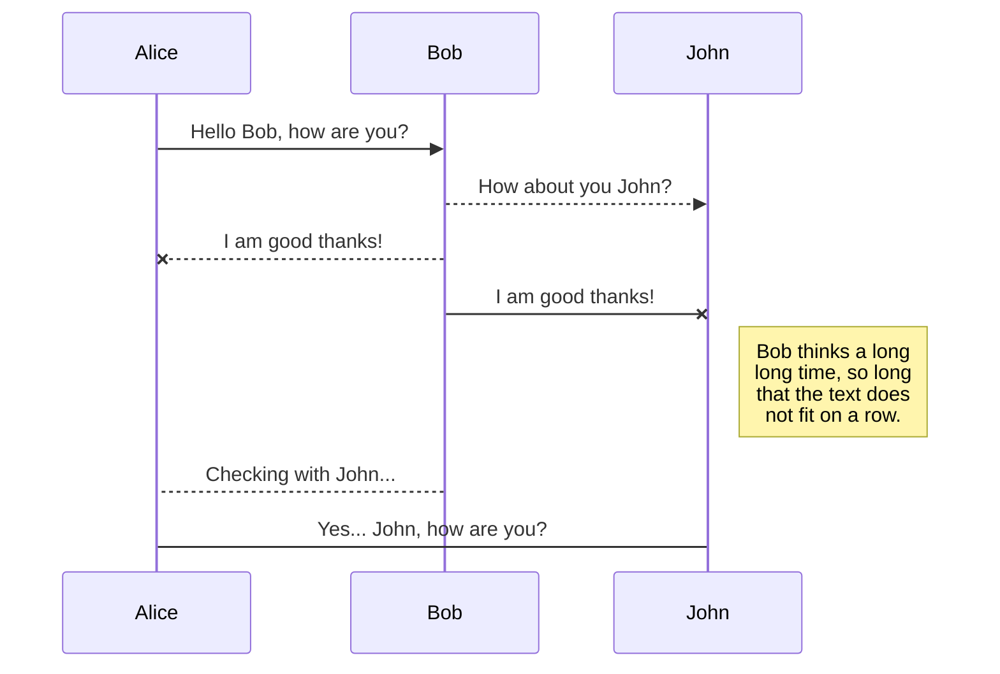
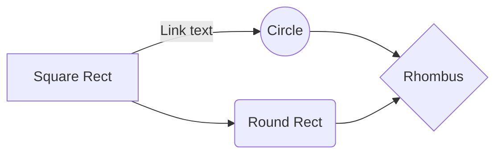

# Impact-of-Lifestyle-on-PCas-from-Knowledge-Graph-to-Chatbot-

This repository is about the paper Modeling the Impact of Lifestyle on PCas: from Knowledge Graph to Chatbot by Fei Ye <sup>1*</sup>, ; Baivab Sinha<sup>1*</sup>; Yalan Chen<sup>2*</sup>;Tong Tang<sup>1</sup>; Rongrong Wu<sup>1</sup>; Mengqiao He<sup>1</sup>,Xiaonan Zheng<sup>3</sup>; Qiang Wei<sup>3</sup>, Bairong Shen<sup>1</sup>

><sup>1</sup>Institutes for Systems Genetics, Frontiers Science Center for Disease-related Molecular Network, West China Hospital, Sichuan University, Chengdu, 610041, China.
><sup>2</sup>Department of Medical Informatics, School of Medicine, Nantong University, Nantong, China.
><sup>3</sup>Department of Urology, West China Hospital, Sichuan University, Chengdu, China.


**Background:** Personal lifestyle is an important cause of prostate cancer (PCa), hence establishing a corresponding knowledge graph (KG) is a convenient way for preventing and assessing risks. However, currently, there exists no work on the construction and application of this kind of KG.

**Objective:** In this paper, we established a KG based on PCa-associated lifestyles, called PCalfst_KG, which extracts knowledge from the existing Knowledge Base (KB). Then we visualized it and designed a chatbot based on a dialogue system whose responses come from PCalfst_KG.

**Methods:** From the existing KB, we define entities based on the items and corresponding relationships based on the primary key and foreign key. We establish the PCalfst_KG by importing the triples into the Neo4j server. The visualization is based on node.js and d3.js technology. The dialogue system uses the Flask framework to determine the classification of questions through entity recognition and relationship extraction and later uses the query template to search the answers from the PCalfst_KG.

**Results:** The PCalfst_KG contains 11 types of entities and 14 types of relationships, the total number of nodes and links is 21546 and 66493, respectively. Also, the entity “Lifestyle”, “Paper”, “Baseline” and “Outcome” contain multiple attributes. The established chatbot can answer 12 basic questions and predict the probability of a certain lifestyle resulting in a certain PCa.

**Conclusions:** The lifestyle-associated KB is transformed into a professional KG and conveniently visualized. We have initially constructed a chatbot based on PCalfst_KG to help researchers or physicians learn more about PCa interactively.

# Gallery

For more examples, visit our  [project page](http://rpg.ifi.uzh.ch/timelens).

# Set-up

## Data Acquisition

The PCaLiStDB which is standardized for PCa_LWAS is publicly available [here](http://www.sysbio.org.cn/pcalistdb/). In the PCaListDB database, there exists a total of 3024 lifestyles items comprising 394 protective items, 556 risk items, 45 uninfluential items, 52 ambivalent items, and 1977 items that lack adequate literature support. These items are summarized and classified into three SQL tables.


The types of entity and corresponding count in PCalfst_KG

|       Entity   |Properties                     |Count                        |
|----------------|-------------------------------|-----------------------------|
|       Lifestyle   |factor_type; fenlei; index_name; inv_papers; level_class; name; paper_count; pca_type; unit.                     |2290                        |
|       Paper   |area; author; duration; gene; name; sample_size; study_type; title; year.                     |300                        |
|       Baseline   |group_number; index_name; name; notes; pmid; stratification; value.                     |2570                        |
|       Outcome   |aj_value; eaj; eunaj; index_name; name; notes; pcatype; pmid; stratification; unaj_value; unit.                     |15586                        |
|       PCa   |Properties                     |79                        |
|       Nation   |Properties                     |31                        |
|       Unit   |Properties                     |125                        |
|       Gene   |Properties                     |38                        |
|       FirClass   |Properties                     |11                        |
|       SecClass   |Properties                     |294                        |
|       ThrClass   |Properties                     |22                        |


		
Lifestyle	factor_type; fenlei; index_name; inv_papers; level_class; name; paper_count; pca_type; unit.	2290
Paper	area; author; duration; gene; name; sample_size; study_type; title; year.	300
Baseline	group_number; index_name; name; notes; pmid; stratification; value.	2570
Outcome	aj_value; eaj; eunaj; index_name; name; notes; pcatype; pmid; stratification; unaj_value; unit.	15586
PCa	-	79
Nation	-	31
Unit	-	125
Gene	-	38
FirClass	-	11
SecClass	-	294
ThrClass	-	222


## Install nodejs
Node.js is a run-time environment which includes everything you need to execute a program written in JavaScript. It’s used for running scripts on the server to render content before it is delivered to a web browser.

NPM stands for Node Package Manager, which is an application and repository for developing and sharing JavaScript code.

Step 1: Download Node.js Installer
In a web browser, navigate to [nodejs website](https://nodejs.org/en/download/). Click the Platform Installer button to download the latest default version

Step 3: Verify Installation
Open a command prompt (or PowerShell), and enter the following:
```
node -v
```
The system should display the Node.js version installed on your system. You can do the same for NPM:
```
npm -v
```
## Flask
Flask is a lightweight WSGI web application framework. It is designed to make getting started quick and easy, with the ability to scale up to complex applications. 

Installing
Install and update using pip:
```python
$ pip install -U Flask
```
A Simple Example
```python
# save this as app.py
from flask import Flask

app = Flask(__name__)

@app.route("/")
def hello():
    return "Hello, World!"
```
```python
$ flask run
  * Running on http://127.0.0.1:5000/ (Press CTRL+C to quit)
```
## Neo4j
Neo4j is available both as a standalone server, or an embeddable component. You can [download](https://neo4j.com/download/) from here .


Step 1 Clone [this](https://github.com/neo4j/neo4j-browser) repo

Step 2 Install yarn globally (not required but recommended): npm install -g yarn

Step 3 Install project dependencies: yarn


yarn start and point your web browser to http://localhost:8080.

## Project Set Up

Knowledge Graph

### Flow chart for establishing the PCalfst_KG


### The principle of visualizing the core knowledge graph for the inquired lifestyles


Chat Bot

### The realization principle of the dialogue system based on Pcalfst_KG


Question and answer examples of 10 basic design questions
|       Question   |Synoonym                     |Classification                        |Response                        |
|----------------|-------------------------------|-----------------------------|-----------------------------|
|Which papers are related to the lifestyle [genistein]?|survey, paper, investigation, research, report   |  Asks related papers   | The PMID of related papers about genistein is 17634273;19235037;…|
|Can you give me brief information on paper whose PMID is [17634273]?|survey, paper, investigation, research, report   |  Asks related papers   | The detailed information of the paper is as follows: Title: xxx
Author: xxx …|
|Can you give me brief information of baseline whose ID is [pbase_102]?|survey, paper, investigation, research, report   |  Asks related papers   | index_name: xxx; group_number: xxx; stratification: xxx; …|
Can you give me brief information of the outcome whose ID is [pcaoc_4584]?|survey, paper, investigation, research, report   |  Asks related papers   | index_name: xxx; pcatype: xxx;
eaj: xxx; aj_value: xxx; …|
How do we measure the lifestyle [genistein]?|measurement, unit, measure, dosage  |  Asks units   | The corresponding units of genistein are g/day; mg/day;…|
Where the lifestyle [genistein] may appear?|where, area, country, nation, region, location, appear  |  Asks geographical areas   | From KG, we find that the genistein appears in Japan, China, Italy,|
Can you give the involved baselines of lifestyle [genistein]?|-  | Asks baselines of lifestyle   | The possible baselines of genistein are pbase_102, …|
What is the influence factor of lifestyle [genistein]?|-  | Asks influencing factor   | The influence factor of genistein is “No statistical significance factor”, “Protective factor; impact level: Strong”.|
Which class level the lifestyle [genistein] belongs to?|kind, class, type, classification, belong  | Asks class level  |The genistein belongs to classes:  food composition, plant compounds, genistein|
Lifestyle [genistein] can lead to which kind of PCas? |Pca, illness, sickness, disease, pathema, prostate cancer, prostatic carcinoma, CRPC, prostatic cancer, cancer | PCas led  by lifestyle |The genistein may lead to total/local/advanced PCa.|
When lifestyle [genistein] leads [total PCa], please give possible outcomes. |- | Asks about the outcomes of PCas |The total PCa may bring about outcomes: pcaoc_4584,.|
How many genes may [advance PCa] be associated with?  |-| Asks about associated genes |The advanced PCa is associated with genes such as xxx.|


QUESTIONS exm	Synonym	Classification	R exm
	information, introduction, detailed information, specific information, core information, brief introduction, brief information	ask information
(paper/baseline/outcome)	The detailed information of the paper is as follows: Title: xxx
Author: xxx …
Can you give me brief information of baseline whose ID is [pbase_102]?			index_name: xxx; group_number: xxx; stratification: xxx; …
Can you give me brief information of the outcome whose ID is [pcaoc_4584]?			index_name: xxx; pcatype: xxx;
eaj: xxx; aj_value: xxx; …
How do we measure the lifestyle [genistein]?	measurement, unit, measure, dosage	Asks units	The corresponding units of genistein are g/day; mg/day;…
Where the lifestyle [genistein] may appear?	where, area, country, nation, region, location, appear	Asks geographical areas	From KG, we find that the genistein appears in Japan, China, Italy,…
Can you give the involved baselines of lifestyle [genistein]?	-	asks baselines of lifestyle	The possible baselines of genistein are pbase_102, …
What is the influence factor of lifestyle [genistein]?	-	Asks influencing factor	The influence factor of genistein is “No statistical significance factor”, “Protective factor; impact level: Strong”.
Which class level the lifestyle [genistein] belongs to?	kind, class, type, classification, belong	Asks class level 	The genistein belongs to classes:  food composition, plant compounds, genistein.
Lifestyle [genistein] can lead to which kind of PCas? 	Pca, illness, sickness, disease, pathema, prostate cancer, prostatic carcinoma, CRPC, prostatic cancer, cancer	PCas led  by lifestyle	The genistein may lead to total/local/advanced PCa.
When lifestyle [genistein] leads [total PCa], please give possible outcomes.	-	Asks about the outcomes of PCas	The total PCa may bring about outcomes: pcaoc_4584,….
How many genes may [advance PCa] be associated with? 	-	Asks about associated genes	The advanced PCa is associated with genes such as xxx.


# Welcome to StackEdit!

Hi! I'm your first Markdown file in **StackEdit**. If you want to learn about StackEdit, you can read me. If you want to play with Markdown, you can edit me. Once you have finished with me, you can create new files by opening the **file explorer** on the left corner of the navigation bar.


# Files

StackEdit stores your files in your browser, which means all your files are automatically saved locally and are accessible **offline!**

## Create files and folders

The file explorer is accessible using the button in left corner of the navigation bar. You can create a new file by clicking the **New file** button in the file explorer. You can also create folders by clicking the **New folder** button.

## Switch to another file

All your files and folders are presented as a tree in the file explorer. You can switch from one to another by clicking a file in the tree.

## Rename a file

You can rename the current file by clicking the file name in the navigation bar or by clicking the **Rename** button in the file explorer.

## Delete a file

You can delete the current file by clicking the **Remove** button in the file explorer. The file will be moved into the **Trash** folder and automatically deleted after 7 days of inactivity.

## Export a file

You can export the current file by clicking **Export to disk** in the menu. You can choose to export the file as plain Markdown, as HTML using a Handlebars template or as a PDF.


# Synchronization

Synchronization is one of the biggest features of StackEdit. It enables you to synchronize any file in your workspace with other files stored in your **Google Drive**, your **Dropbox** and your **GitHub** accounts. This allows you to keep writing on other devices, collaborate with people you share the file with, integrate easily into your workflow... The synchronization mechanism takes place every minute in the background, downloading, merging, and uploading file modifications.

There are two types of synchronization and they can complement each other:

- The workspace synchronization will sync all your files, folders and settings automatically. This will allow you to fetch your workspace on any other device.
	> To start syncing your workspace, just sign in with Google in the menu.

- The file synchronization will keep one file of the workspace synced with one or multiple files in **Google Drive**, **Dropbox** or **GitHub**.
	> Before starting to sync files, you must link an account in the **Synchronize** sub-menu.

## Open a file

You can open a file from **Google Drive**, **Dropbox** or **GitHub** by opening the **Synchronize** sub-menu and clicking **Open from**. Once opened in the workspace, any modification in the file will be automatically synced.

## Save a file

You can save any file of the workspace to **Google Drive**, **Dropbox** or **GitHub** by opening the **Synchronize** sub-menu and clicking **Save on**. Even if a file in the workspace is already synced, you can save it to another location. StackEdit can sync one file with multiple locations and accounts.

## Synchronize a file

Once your file is linked to a synchronized location, StackEdit will periodically synchronize it by downloading/uploading any modification. A merge will be performed if necessary and conflicts will be resolved.

If you just have modified your file and you want to force syncing, click the **Synchronize now** button in the navigation bar.

> **Note:** The **Synchronize now** button is disabled if you have no file to synchronize.

## Manage file synchronization

Since one file can be synced with multiple locations, you can list and manage synchronized locations by clicking **File synchronization** in the **Synchronize** sub-menu. This allows you to list and remove synchronized locations that are linked to your file.


# Publication

Publishing in StackEdit makes it simple for you to publish online your files. Once you're happy with a file, you can publish it to different hosting platforms like **Blogger**, **Dropbox**, **Gist**, **GitHub**, **Google Drive**, **WordPress** and **Zendesk**. With [Handlebars templates](http://handlebarsjs.com/), you have full control over what you export.

> Before starting to publish, you must link an account in the **Publish** sub-menu.

## Publish a File

You can publish your file by opening the **Publish** sub-menu and by clicking **Publish to**. For some locations, you can choose between the following formats:

- Markdown: publish the Markdown text on a website that can interpret it (**GitHub** for instance),
- HTML: publish the file converted to HTML via a Handlebars template (on a blog for example).

## Update a publication

After publishing, StackEdit keeps your file linked to that publication which makes it easy for you to re-publish it. Once you have modified your file and you want to update your publication, click on the **Publish now** button in the navigation bar.

> **Note:** The **Publish now** button is disabled if your file has not been published yet.

## Manage file publication

Since one file can be published to multiple locations, you can list and manage publish locations by clicking **File publication** in the **Publish** sub-menu. This allows you to list and remove publication locations that are linked to your file.


# Markdown extensions

StackEdit extends the standard Markdown syntax by adding extra **Markdown extensions**, providing you with some nice features.

> **ProTip:** You can disable any **Markdown extension** in the **File properties** dialog.


## SmartyPants

SmartyPants converts ASCII punctuation characters into "smart" typographic punctuation HTML entities. For example:

|                |ASCII                          |HTML                         |
|----------------|-------------------------------|-----------------------------|
|Single backticks|`'Isn't this fun?'`            |'Isn't this fun?'            |
|Quotes          |`"Isn't this fun?"`            |"Isn't this fun?"            |
|Dashes          |`-- is en-dash, --- is em-dash`|-- is en-dash, --- is em-dash|


## KaTeX

You can render LaTeX mathematical expressions using [KaTeX](https://khan.github.io/KaTeX/):

The *Gamma function* satisfying $\Gamma(n) = (n-1)!\quad\forall n\in\mathbb N$ is via the Euler integral

$$
\Gamma(z) = \int_0^\infty t^{z-1}e^{-t}dt\,.
$$

> You can find more information about **LaTeX** mathematical expressions [here](http://meta.math.stackexchange.com/questions/5020/mathjax-basic-tutorial-and-quick-reference).


## UML diagrams

You can render UML diagrams using [Mermaid](https://mermaidjs.github.io/). For example, this will produce a sequence diagram:



And this will produce a flow chart:


